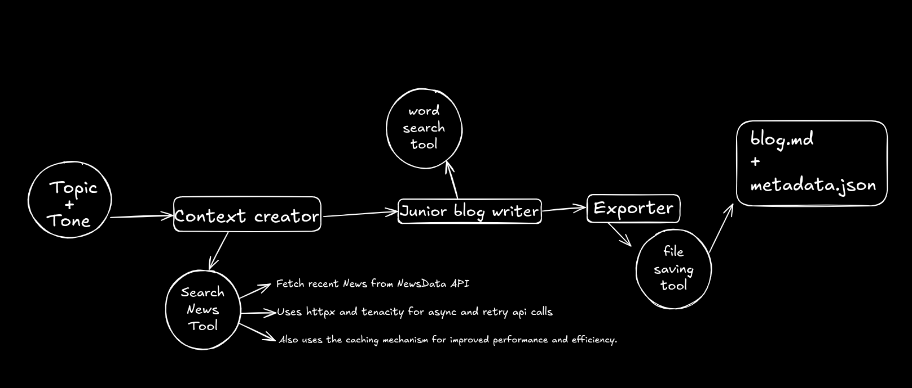

# Blogsmith 

Welcome to the Blogsmith project,BlogSmith is a Python-based AI tool for writing SEO-friendly blog posts, powered by popular APIs and capable of generating content in a specified tone.

## Installation

Ensure you have Python >=3.10 <3.13 installed on your system. This project uses [UV](https://docs.astral.sh/uv/) for dependency management and package handling, offering a seamless setup and execution experience.

First, if you haven't already, install uv:

```bash
pip install uv
```
### Customizing

Add your own **API keys** to the `.env` file for tools and the LLM agent.

## Running the Project

To run the agent, simply execute the [run.sh](./run.sh) script.

Once the agent completes the writing, you can access the logs in the `logs` directory.

The complete output of the writing and its metadata will be saved in the `output` directory.

You can specify the tone of the generated content by adding the `--tone` argument. 

## Blogsmith Workflow Description

The Blogsmith system is a modular, agent-based blogging pipeline built with the CrewAI framework. It consists of three main agents working sequentially: a context collector, a content creator, and an exporter. Each agent is tightly integrated with specific tools and optimizations to ensure fast, reliable, and high-quality blog generation.



First, the context collector takes the topic and tone as input, breaks it into smaller pieces, and uses the Search News Tool to gather the most recent and relevant information.

Next, the junior blog writer (content creator) uses that input and, with help from the Word Search Tool, enriches the vocabulary to craft an engaging, well-structured blog post.

Finally, the exporter takes the finished blog, formats it in Markdown, and extracts structured metadata for SEO optimization.

This is how Blogsmith creates high-quality, fully SEO-optimized blog posts—autonomously and smartly.


## 🛠️ Tools & API Utilities
Blogsmith integrates smart tooling to enhance reliability, speed, and SEO effectiveness throughout the blog generation pipeline. These tools are modular, async-friendly, and designed for agent-specific tasks.

### 🌐 httpx
Used for making fast, async HTTP requests to APIs like NewsData.io, Datamuse, and Quotable. Enables concurrent data fetching during the research phase.

### 🔁 tenacity
Implements robust retry logic for all external API calls. Ensures that transient failures (e.g., rate limits, network hiccups) don't break the agent workflow.

### 🧠 functools.lru_cache
Caches function results for frequently requested data (e.g., keyword searches, static queries). This improves performance and avoids redundant computations.

### 📦 requests_cache
Persists responses from API calls across runs to reduce load on third-party services and increase performance when re-running with similar topics.

### 🧰 Custom Tools
SearchNewsTool: Fetches trending articles, facts, and developments from the NewsData API.

WordSearchingTool: Retrieves related or semantic keyword suggestions using Datamuse for SEO optimization.

SaveFileTool: Handles the final export of blog content and metadata in .md and .json formats.

These tools are injected into agents contextually, keeping each agent focused, modular, and API-aware.

## Example usage 

```sh
./run.sh "how to improve memory" --tone="medical"
```

If topic and tone are new to agent then it might take around 80s to write the blog , but if there are similare topic in blog post then thanks to the **requests_cache** it will only take 30-40s since most of requests are cache during run

you can find output of this in the [blog](./output/enhancing-cognitive-function_blog.md) and [metadata](./output/enhancing-cognitive-function_metadata.json)